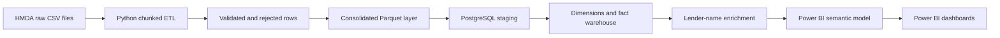
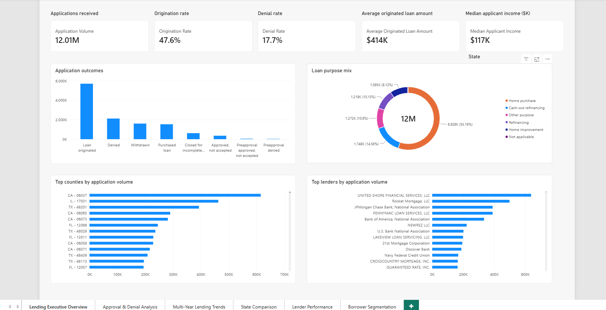
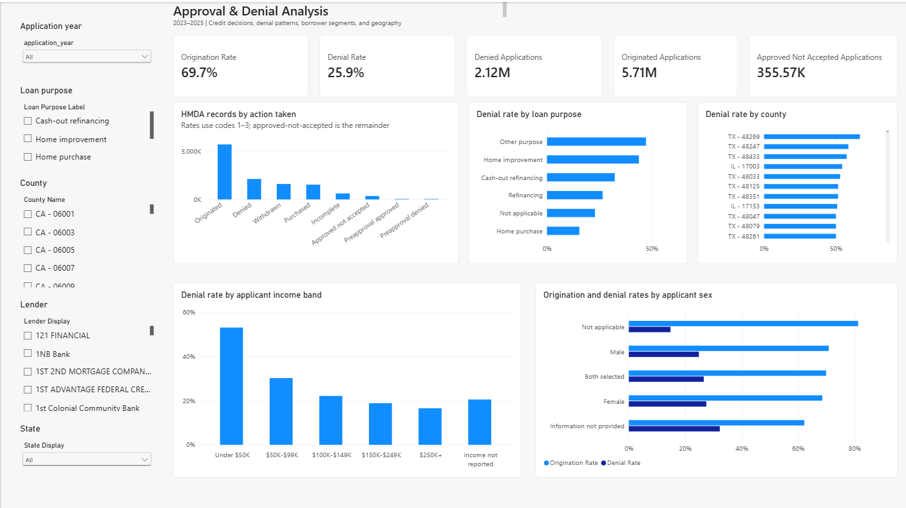
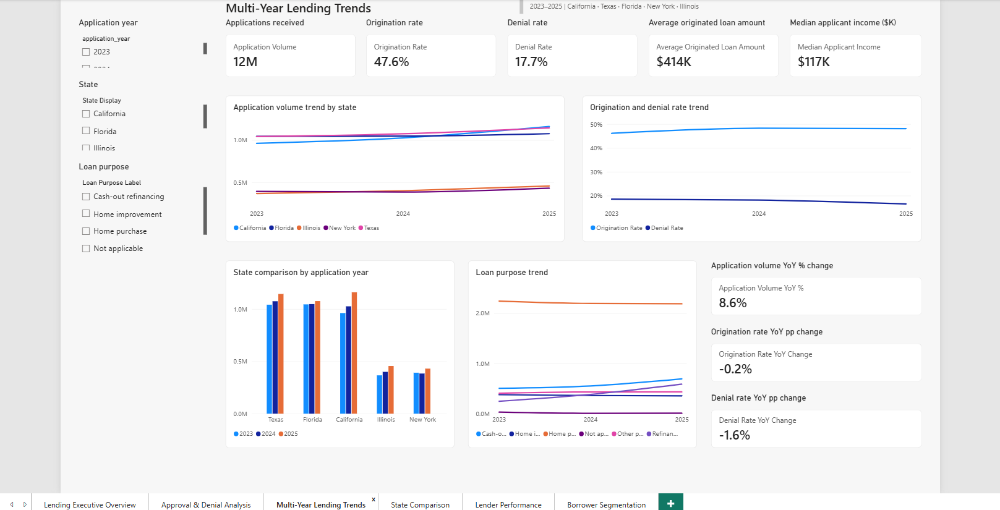
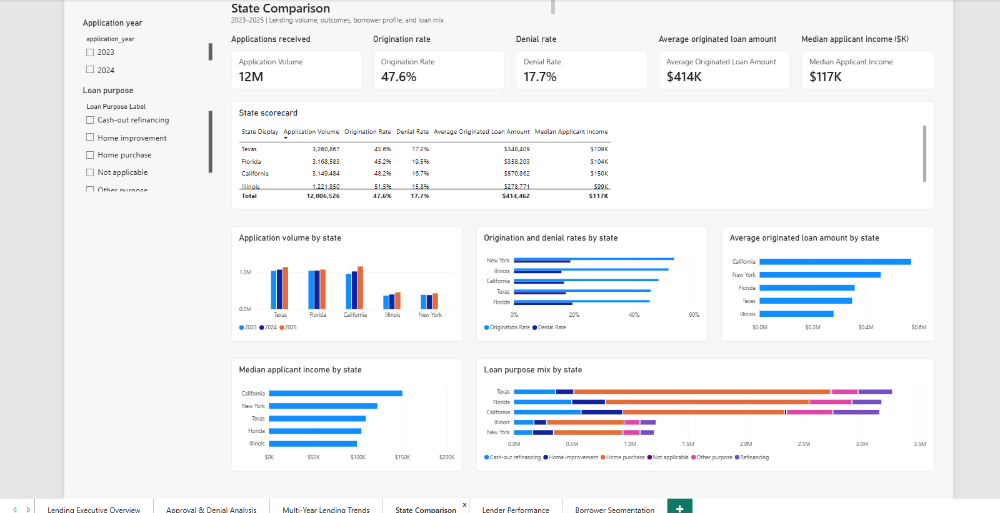
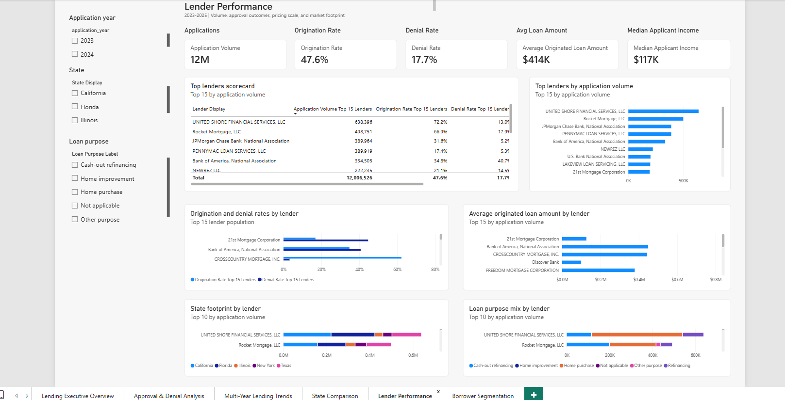
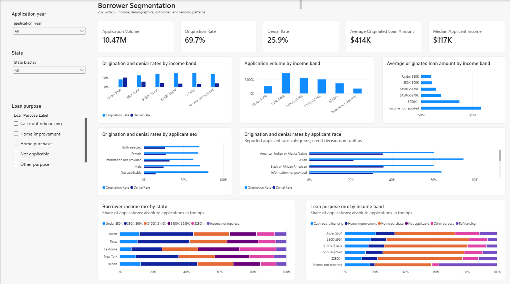

# Banking Lending Intelligence Dashboard

An end-to-end data engineering and business intelligence project built on public Home Mortgage Disclosure Act (HMDA) mortgage application data.

The project transforms 12,006,526 HMDA source records across California, Texas, Florida, New York, and Illinois into a validated PostgreSQL star schema and a six-page Power BI dashboard suite for lending outcomes, state trends, lender benchmarking, and borrower segmentation.

## Business Problem

Mortgage lending data is large, highly coded, and difficult to explain directly from raw files. Analysts and business leaders need a trusted model that can answer questions such as:

- How many applications were received, originated, denied, withdrawn, or approved but not accepted?
- How do lending outcomes vary across states, counties, loan purposes, income bands, and lenders?
- Which large lenders drive application volume and how do their outcome rates compare?
- How do borrower profiles and loan purposes shift across years and geographies?
- Can the warehouse reconcile raw source rows to analytical fact rows without duplicates or orphaned dimension keys?

This project builds the data foundation, validation controls, and Power BI semantic model needed to answer those questions consistently.

## Final Project Metrics

| Metric | Final verified result |
|---|---:|
| HMDA source records loaded to fact | 12,006,526 |
| Years | 2023, 2024, 2025 |
| States | CA, TX, FL, NY, IL |
| Logical state/year combinations | 15 |
| PostgreSQL staging rows | 12,006,526 |
| PostgreSQL fact rows | 12,006,526 |
| Duplicate staging row IDs (primary-key integrity) | 0 |
| Unmatched dimension keys | 0 |
| Staging-to-fact reconciliation difference | 0 |
| Lenders in `dim_lender` | 3,783 |
| Lenders with official names | 3,712 |
| LEI fallback lenders | 71 |
| Lender-name coverage | 98.12% |
| Power BI report pages | 6 |

## Dataset and Source

The project uses public HMDA Loan/Application Register data. HMDA was selected because it is a real regulatory dataset with the characteristics expected in production analytical engineering work:

- Large row counts across multiple years and jurisdictions.
- Wide source files with a 99-column schema.
- Business-critical coded values that require readable analytical labels.
- Real-world data quality edge cases, including missing county values and not-reported demographic fields.
- Natural dimensional modeling opportunities across lender, geography, loan, applicant profile, and action taken.

Raw CSV files are stored locally and intentionally excluded from Git because of their size.

## Technology Stack

- Python, pandas, PyArrow, and Parquet for chunked ETL and processed data storage.
- SQLAlchemy and psycopg2 for PostgreSQL connectivity.
- PostgreSQL 18 for staging, dimensional warehouse tables, validation, and analytics views.
- PostgreSQL `COPY FROM STDIN` for fast staging loads.
- pytest for automated regression coverage.
- Power BI PBIP, TMDL, and PBIR for the semantic model and report source files.
- Git and GitHub for source control and documentation.

## Architecture



The pipeline supports both source-file patterns:

- `hmda_<YEAR>_<STATE>.csv` for per-state files.
- `hmda_<YEAR>_multi_state.csv` for yearly multi-state files.

The finalized warehouse uses one 2023 multi-state file and per-state files for 2024 and 2025. The ingestion logic fails clearly if a multi-state file and same-year per-state files would create ambiguous duplicate coverage.

## Warehouse Design

The analytical warehouse uses a star schema:

- `analytics.dim_lender`
- `analytics.dim_geography`
- `analytics.dim_loan`
- `analytics.dim_applicant_profile`
- `analytics.dim_action_taken`
- `analytics.fact_loan_application`

`fact_loan_application` stores one row per valid HMDA source record loaded from staging. The five dimensions use deterministic business-key matching so fact rows can be validated against source rows and dimension keys.

## ETL and Data Quality Controls

The Python ETL processes raw CSV files sequentially in chunks so memory usage remains bounded. It preserves source schema compatibility, writes valid rows to a consolidated Parquet dataset, writes rejected rows to a rejected-row Parquet dataset, and produces reconciliation counts by source file, year, and state.

The PostgreSQL load process then:

- Checks the Parquet input before modifying staging and reloads staging in one transaction; a failed batch rolls back the staging replacement.
- Generates `stg_row_id`, `load_timestamp`, and `profile_hash`.
- Uses PostgreSQL `COPY FROM STDIN` for bulk staging load performance.
- Populates dimensions at stable business grains.
- Loads the fact table through validated dimension joins.
- Runs dynamic validation against the current warehouse rather than fixed row-count constants.

Final warehouse validation status:

```text
Staging rows:                         12,006,526
Fact rows:                            12,006,526
Duplicate staging row IDs:                     0
Null mandatory fact keys:                      0
Invalid action codes:                          0
Invalid non-positive loan amounts:             0
Unmatched dimension keys:                      0
Staging-to-fact reconciliation diff:           0
```

## Lender Enrichment

The public HMDA LAR files contain LEIs but not lender names. To make lender reporting readable without changing fact grain or foreign keys, lender names are treated as reference enrichment.

The enrichment process uses official HMDA/FFIEC/CFPB institution metadata, stores the result in `analytics.dim_lender.lender_name`, and keeps `lei` as the stable identifier. Power BI uses a `Lender Display` field that shows the official lender name when matched and falls back to the LEI when no official name is available.

Current enrichment status:

| Metric | Result |
|---|---:|
| Distinct lenders | 3,783 |
| Official lender names matched | 3,712 |
| LEI fallback values | 71 |
| Match rate | 98.12% |

## Power BI Dashboards

The PBIP report contains six dashboard pages:

1. **Lending Executive Overview** - high-level application volume, origination rate, denial rate, originated loan amount, applicant income, outcomes, loan purpose mix, top counties, and top lenders.
2. **Approval & Denial Analysis** - diagnostic outcome analysis by decision, loan purpose, county, applicant income band, and applicant sex.
3. **Multi-Year Lending Trends** - 2023-2025 volume and outcome trends by year, state, and loan purpose, including year-over-year movement.
4. **State Comparison** - side-by-side comparison of the five states across volume, rates, loan amount, income, and loan mix.
5. **Lender Performance** - top lender benchmarking using human-readable lender names, outcome rates, average originated loan amount, state footprint, and loan purpose mix.
6. **Borrower Segmentation** - outcomes and volume by applicant income band, race, sex, state composition, and loan purpose.

The Power BI semantic model keeps reusable measures numeric, uses single-direction dimension-to-fact relationships, and handles display formatting at the visual layer where practical.

## Key Engineering Decisions

- **Chunked ETL:** Process raw files in bounded chunks rather than loading multi-million-row CSV files fully into memory.
- **Consolidated Parquet layer:** Persist cleaned rows once so PostgreSQL loading and validation can operate from a stable processed dataset.
- **PostgreSQL COPY optimization:** Replace slow pandas/SQLAlchemy multi-row staging inserts with native `COPY FROM STDIN`.
- **Deterministic dimension keys:** Use stable business grains for lender, geography, loan, applicant profile, and action taken.
- **Dynamic validation:** Reconcile staging and fact row counts at runtime instead of relying on California-only constants.
- **Multi-state and multi-year ingestion:** Support 2023-2025 data across CA, TX, FL, NY, and IL.
- **Yearly multi-state files:** Support `hmda_<YEAR>_multi_state.csv` without physically splitting the file.
- **Lender metadata enrichment:** Keep lender names as official reference enrichment outside the LAR ingestion path.
- **Power BI semantic model:** Use reusable measures and business-readable labels while preserving the warehouse grain.

## Challenges Solved

- **Initial incomplete batch loading bug:** An early California-only load produced 11,292 rows instead of 1,161,292. The batching flow was corrected and covered with validation.
- **Stale loan-dimension grain:** `dim_loan` was corrected to a seven-field business grain so distinct loan products were not collapsed incorrectly.
- **Geography mismatch issue:** Dimension and fact normalization were aligned so geography keys match consistently.
- **Texas missing-county edge case:** A Texas row with `county_code = NULL` and a valid census tract exposed the need to derive county from `LEFT(census_tract, 5)`.
- **Slow staging inserts:** The original pandas/SQLAlchemy insert path was too slow for large loads. Native PostgreSQL COPY loaded 100,000 rows in 9.788 seconds at about 10,216 rows per second.
- **Unsupported `MEDIAN()` in PostgreSQL:** Analytics views were updated to use `PERCENTILE_CONT(0.5) WITHIN GROUP`.
- **Hard-coded validation counts:** California-only row-count validation was redesigned to reconcile the current warehouse dynamically.
- **California-only county mapping:** Power BI county labeling was made safe for the five-state warehouse.
- **Stale Power BI expected row count:** The semantic model validation measure was updated from 1,161,292 to 12,006,526.
- **Lender LEI readability problem:** Official lender-name enrichment and Power BI fallback display logic replaced raw LEIs where names are available.

## Recruiter-Facing Summary

- Built a Python, PostgreSQL, and Power BI analytics project over 12,006,526 public HMDA mortgage application records across five states and three years.
- Designed a validated star schema with five dimensions and one fact table, achieving 0 duplicate staging row IDs, 0 unmatched dimension keys, and 0 staging-to-fact reconciliation difference.
- Optimized PostgreSQL staging loads with `COPY FROM STDIN`, reducing a 100,000-row benchmark from roughly 18 minutes to 9.788 seconds.
- Enriched 3,783 lender records with official HMDA/FFIEC/CFPB metadata, reaching 98.12% human-readable lender-name coverage.
- Delivered a six-page Power BI dashboard suite covering executive KPIs, approval and denial diagnostics, trends, state comparison, lender performance, and borrower segmentation.

## 60-90 Second Interview Explanation

This project is an end-to-end lending analytics warehouse and Power BI dashboard built on public HMDA mortgage application data. It started as a California-only pipeline and evolved into a five-state, three-year warehouse covering CA, TX, FL, NY, and IL for 2023 through 2025, with 15 logical state/year combinations and 12,006,526 validated fact rows.

The pipeline discovers raw HMDA files using both per-state and yearly multi-state naming conventions, processes them in pandas chunks, separates rejected rows, writes a consolidated Parquet layer, and bulk-loads PostgreSQL staging using `COPY FROM STDIN`. From there, it populates a star schema with lender, geography, loan, applicant profile, and action-taken dimensions around a loan application fact table.

The project includes dynamic validation, PostgreSQL analytics views, official lender-name enrichment, and a Power BI PBIP report with six analytical pages. A major performance win was replacing slow SQLAlchemy inserts with PostgreSQL COPY, which loaded 100,000 rows in 9.788 seconds. The final warehouse reconciles 12,006,526 staging rows to 12,006,526 fact rows with zero duplicate source rows, zero unmatched dimension keys, and zero staging-to-fact difference.

## Dashboard Preview

**Lending Executive Overview** - executive KPIs, outcome mix, top counties, and top lenders.



**Approval & Denial Analysis** - diagnostic view of decision outcomes and denial-rate patterns.



**Multi-Year Lending Trends** - 2023-2025 volume and outcome trends across the five-state warehouse.



**State Comparison** - state-level comparison of volume, outcomes, borrower profile, and loan mix.



**Lender Performance** - top lender benchmarking with enriched lender-name display.



**Borrower Segmentation** - borrower outcome and volume patterns by income, sex, race, state, and loan purpose.



## Dataset Storage

The full HMDA source files and generated Parquet outputs are intentionally excluded from Git because of their size.

Ignored local files include:

```text
data/raw/*.csv
data/processed/*.parquet
```

The ETL code, database schema, validation logic, analytical SQL, Power BI PBIP source files, tests, and documentation remain version controlled.

## Repository Structure

```text
Banking-Lending-Intelligence-Dashboard/
|
|-- data/
|   |-- raw/                 # Local HMDA source files, Git ignored
|   |-- processed/           # Generated Parquet outputs, Git ignored
|   `-- reference/           # Public enrichment/reference outputs when reviewed
|
|-- docs/                    # Architecture, walkthrough, lineage, and validation docs
|-- scripts/                 # Project utilities and enrichment scripts
|-- sql/                     # Warehouse DDL, loading SQL, views, and validation queries
|-- src/                     # Data preparation and validation modules
|-- tests/                   # Automated tests
|-- powerbi/                 # PBIP semantic model and report source files
|
|-- etl_hmda.py
|-- load_data.py
|-- requirements.txt
|-- .env.example
`-- README.md
```

## Validation

Run automated tests with:

```powershell
python -m pytest -q
```

Check the existing warehouse without reloading it:

```powershell
python load_data.py --validate-only
```

This command uses the PostgreSQL settings in `.env`, executes only `sql/06_validation_queries.sql`, and exits nonzero when a check fails or no checks are returned. It does not create tables, truncate data, populate dimensions, or refresh views.

Validation now checks duplicate fact mappings, missing and unknown source-row mappings, and fact/source year, loan amount, and income differences. Equal staging/fact totals alone do not establish one-to-one reconciliation. The historical staging-ID duplicate check tests primary-key integrity; it does not establish that the raw source contains no repeated records. The new checks have not yet been executed on the full warehouse.

`etl_hmda.py` is the current raw-to-Parquet entry point and `load_data.py` is the current warehouse loader. The older `src.main` pipeline and legacy ETL guides are not the canonical rebuild path. The production ETL should not be rerun unless intentionally refreshing the warehouse.

`Application Volume` currently means all loaded HMDA records, including purchased loans and preapproval outcomes. `Origination Rate` and `Denial Rate` divide action codes 1 and 3 respectively by all those records; these are shares of loaded records, not decision-only approval/denial probabilities. Borrower comparisons are descriptive and do not establish causation or discrimination.

## Project Goal

The project demonstrates a complete analytics engineering workflow:

**raw public lending data -> chunked ETL -> validated Parquet -> PostgreSQL star schema -> reference enrichment -> Power BI semantic model -> business dashboards**
